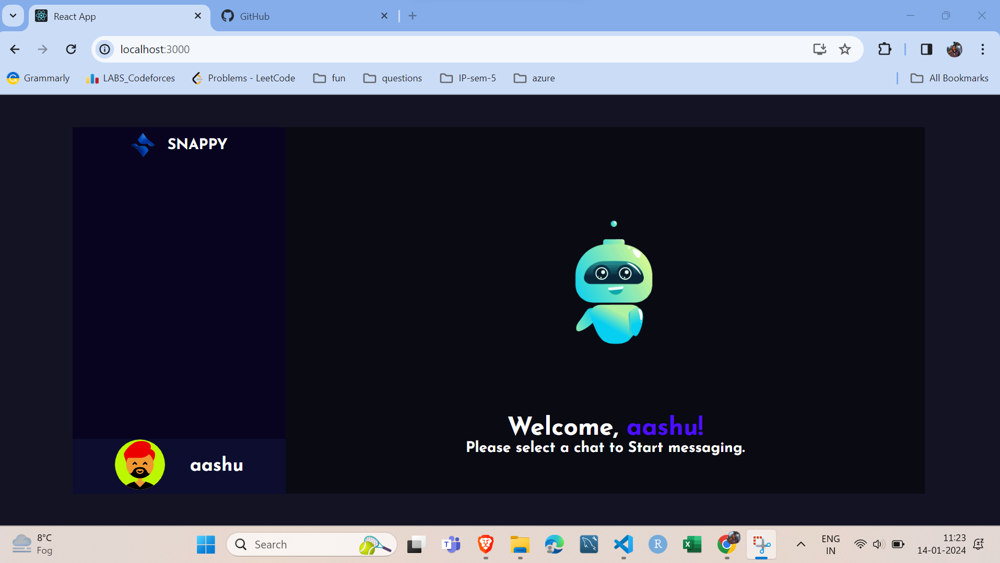
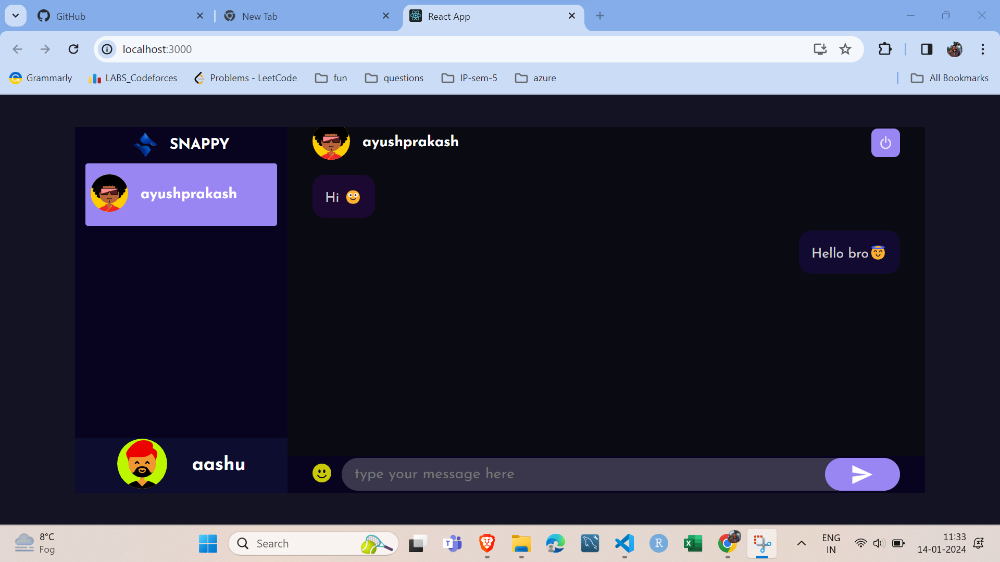

# Snappy - Chat Application 

.png)

#Build
- Developed a responsive real-time chat app using React, Node.js, and Socket.io.
- Integrated MongoDB with Express for data storage.
- Styled components with Styled-Components library for a modern UI.
- Implemented WebSocket communication for instant messaging.
- Achieved seamless, responsive, and interactive user experience in a collaborative chat environment.

